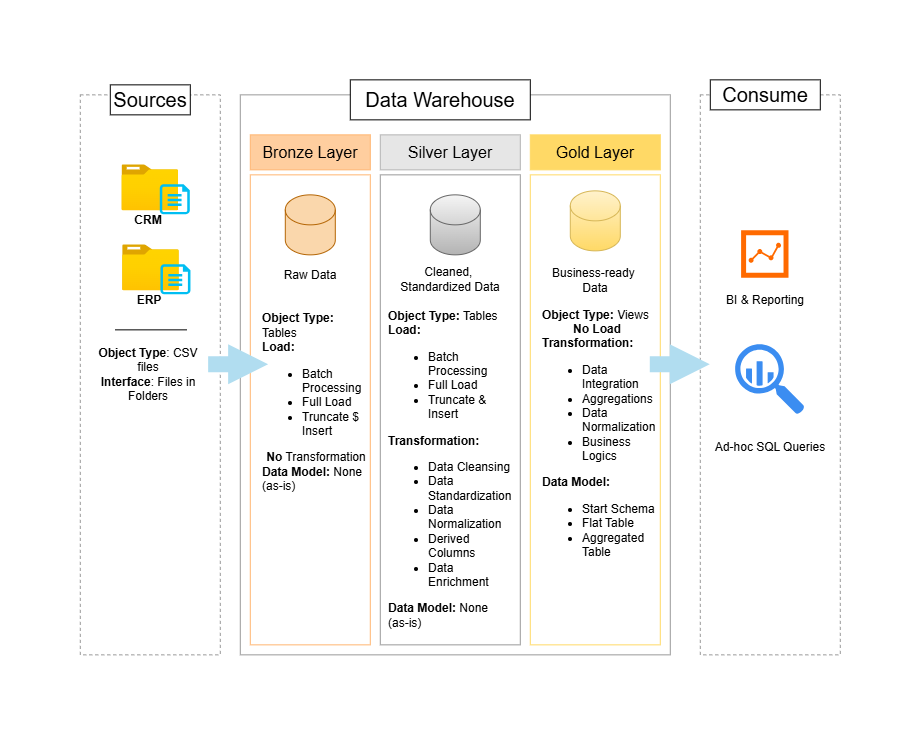

## What the project is about?
This project demonstrates a data warehouse built around **medallion architecture** (bronze → silver → gold), taking messy CRM/ERP source data through cleaning, standardization, and business-ready modeling into a star schema.




# SQL Data Warehouse — Medallion Architecture
This project has two implementations, built sequentially:
- **v1 — MySQL** (`/scripts`, `mysql.yml`): the original build — stored procedures for transformation, manual data-quality checks, Docker Compose for local setup.
- **v2 — dbt + BigQuery** (`/dbt_bigquery`): a full migration adding automated testing, auto-generated lineage documentation, and CI/CD. Built to demonstrate the same modeling logic using the tooling actually used in production analytics engineering roles.

---

## Architecture

**Bronze** — raw source data, loaded as-is from CRM and ERP CSV exports, no transformation.
**Silver** — cleaned, deduplicated, standardized data: type casting, invalid-date handling, code-to-text mapping (e.g. marital status, gender, country), deduplication via `ROW_NUMBER()`.
**Gold** — business-ready star schema: `dim_customers`, `dim_products`, `fact_sales`, ready for direct querying or BI tools.

## Tech stack

| Layer | v1 (MySQL) | v2 (dbt + BigQuery) |
|---|---|---|
| Warehouse | MySQL (Docker) | Google BigQuery |
| Transformation | Stored procedures | dbt models |
| Data quality | Manual SQL checks | dbt tests (`unique`, `not_null`, `relationships`, custom singular tests) |
| Documentation | README only | Auto-generated `dbt docs`, with lineage graph |
| Orchestration/CI | None | GitHub Actions — runs `dbt build` on every push |
| Dependency management | — | `uv` |

## Repository structure

```
sql-data-warehouse/
├── datasets/                  # Raw source CSVs (source_crm/, source_erp/)
├── scripts/                   # v1: MySQL DDL and stored procedures
├── mysql.yml                  # v1: Docker Compose for local MySQL
├── dbt_bigquery/               # v2: dbt project
│   └── warehouse/
│       ├── seeds/             # Raw CSVs loaded into bronze via `dbt seed`
│       ├── models/
│       │   ├── silver/        # Cleaning & standardization models + tests
│       │   └── gold/          # Star schema models + tests
│       ├── macros/            # Custom schema-naming macro for multi-dataset BigQuery setup
│       └── dbt_project.yml
├── .github/workflows/dbt.yml  # CI: runs dbt build + tests on push
└── README.md
```

## Running v1 (MySQL)

```bash
docker compose -f mysql.yml up -d
```
MySQL doesn't support SQL Server's 3-tier object path (`server.schema.table`), so a schema and a database are effectively the same thing here. To represent bronze/silver/gold as distinct layers, each is implemented as its own database with a `dw_` prefix (`dw_bronze`, `dw_silver`, `dw_gold`).

## Running v2 (dbt + BigQuery)

Requires a GCP project with BigQuery enabled and a service account with `BigQuery Data Editor` + `BigQuery Job User` roles.

```bash
cd dbt_bigquery/warehouse
uv run dbt seed      # load raw CSVs into bronze
uv run dbt run       # build silver views and gold tables
uv run dbt test      # run data-quality tests
uv run dbt docs generate && uv run dbt docs serve   # browse lineage graph + docs
```

Or run everything (build + test) in one step, same as CI does:
```bash
uv run dbt build
```

## Data quality

Every key column in silver and gold is covered by automated tests rather than one-off manual queries:
- **Uniqueness & not-null** on all primary/surrogate keys
- **Referential integrity** (`relationships` tests) between `fact_sales` and both dimension tables — every sale must resolve to a real customer and product
- **Custom business-rule tests** (e.g. sales amount must equal quantity × price) where generic tests aren't expressive enough

## CI/CD

Every push to `dbt_bigquery/**` triggers a GitHub Actions workflow that installs dependencies, authenticates to BigQuery via a service-account key stored in GitHub Secrets, and runs `dbt build` — building all models and running all tests. A failing test fails the pipeline visibly, rather than silently shipping bad data.

## Lineage & documentation

`dbt docs generate` produces a full bronze → silver → gold dependency graph along with column-level descriptions and test coverage, browsable via `dbt docs serve`.

## For those who'd like to try running the project themselves
### Tips 💡
I got so tried of manual formatting my SQL code so I downloaded a [SQL formatter](https://github.com/darold/pgFormatter). 

Installation
```text
sudo apt install pgformatter
```

Usage
```text
pg_format -i {filename}
```
or remove the -i flag to have the output in terminal.