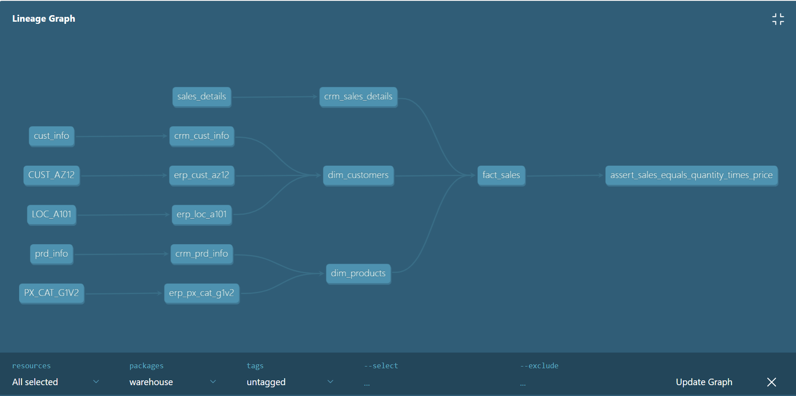

## What the project is about?
This project can be considered an extension of the MySQL warehouse seen at the root directory. The main difference between the two projects is the data warehouse (Google BigQuery) and tool used [dbt](https://www.getdbt.com/).

### More details
In addition to the difference tools, there's also some differences in the modeling choice. 
- Silver -> view
- Gold -> table 

The reason has a lot to do with how BigQuery operates. It charges based on the amount of data it handles per query and data storage is relatively low cost. Having the *Silver* layer as view makes sure the data is always up-to-date with the *Bronze* layer. Besides, the *Silver* layer is not queried as often. 
The Gold layer is what the analytical teams will be using for dashboards or reports, having it as a materialized view (table) will significantly reduces the cost of having to re-build the view. 

### Data lineage 
The following graph shows the data lineage, automatically generated by dbt.

